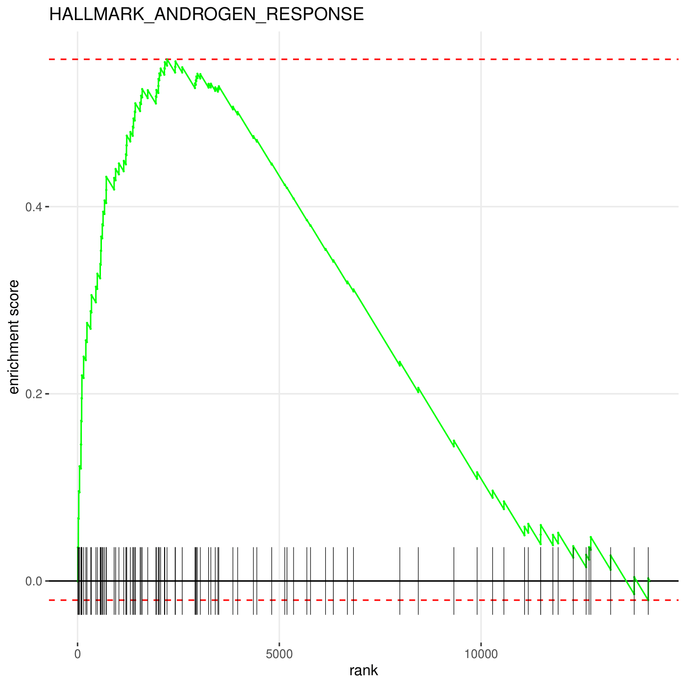
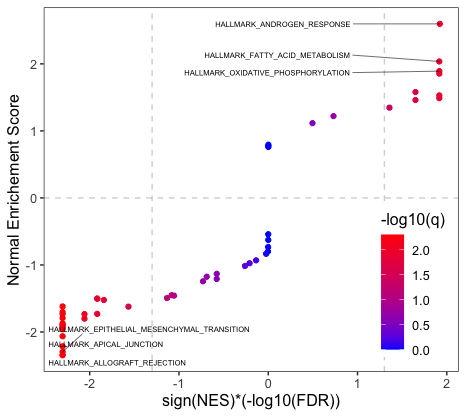
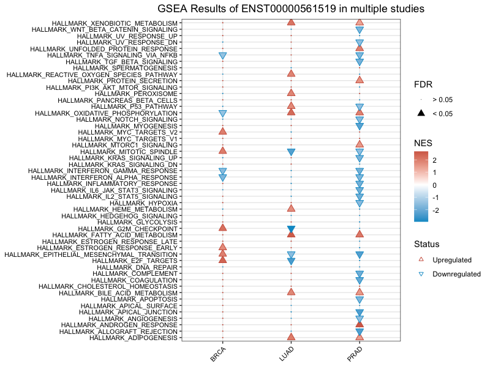

# lncGSEA: an R package to infer lncRNA associated pathways from large-scale cancer transcriptome sequencing data

[](https://travis-ci.com/ylab-hi/lncGSEA)
[](https://ci.appveyor.com/project/ynren1020/lncgsea)


lncGSEA is a convenient tool to predict the lncRNA associated pathways through Gene Set Enrichment Analysis (GSEA) of gene expression profiles from large-scale cancer patient samples. 

##
lncGSEA is developed at [Rendong Yang Lab](https://www.hi.umn.edu/portfolio-items/rendong-yang/) at [The Hormel Institute, University of Minnesota](https://www.hi.umn.edu/).

## Workflow


## Prerequisites

Install required packages
```
install.packages("devtools")
install.packages("data.table")
install.packages(c("dplyr", "stringr","tidyr","tibble","ggplot2"))
install.packages(c("ggrepel", "RColorBrewer"))
devtools::install_github("ctlab/fgsea")
```
Load required packages
```
library(devtools)
library(fgsea)
library(data.table)
library(tibble)
library(dplyr)
library(stringr)
library(tidyr)
library(ggplot2)
library(ggrepel)
library(RColorBrewer)
```
## Install `lncGSEA` 
```
install_github("ylab-hi/lncGSEA")
library(lncGSEA)
```
## Download required datasets 
There are two kinds of datasets required for `lncGSEA` to perform its function of finding enriched pathways regulated by lncRNAs.
- lncRNA expression in human cancer samples. 
  - Two public databases: mitranscriptome beta and RefLnc. The files were named as "mitranscriptome.expr.fpkm.tsv.gz" and "RefLnc_lncRNA_tumor_sample_FPKM.gz", respectively. 
- gene expression matrix (FPKM) for each cohort in TCGA study.
  - Example: PRAD.FPKM.txt, BRCA.FPKM.txt, COAD.FPKM.txt

All datasets can be downloaded from this shared link:
https://drive.google.com/drive/folders/1g3Rl4I5RA2Xf_7u6Y3IBKWCIDYf-w99b?usp=sharing

## Create a `data` folder
Please create a `data` folder in your current working directory by the following command to store the downloaded datasets.

```
if (!file.exists("data")){
    dir.create("data")
}
```

## Examples
### 1. Make the dataset ready for `lnc_gsea`
Create an expression data frame for PRAD cohort. The first column of output should be the cohort name, the first argument of `pre_gsea` and the second column name should be one of the transcript ids of the interested lncRNA (e.g., ENST00000561519 of ARLNC1), other columns are genes from the specific cohort which passed the expression threshold (e.g., mean of FPKM larger than 1). Rows are tumor samples from PRAD cohort. A same transcript id may have different versions, `pre_gsea` use transcript id without version number ("ENST00000561519" instead of "ENST00000561519.[0-9]"). 

```
test <- pre_gsea("PRAD", "ENST00000561519", "./data/")
test[1:5, 1:5]
```

The first 5 rows and columns are shown below:
    


                                  PRAD ENST00000561519.5 TSPAN6  DPM1 SCYL3
     1754 TCGA-G9-7521-01A-11R-2263-07            0.0104  10.62 24.92 1.971
     1757 TCGA-KK-A7AU-01A-11R-A32O-07            0.2343  13.35 23.39 3.539
     1760 TCGA-EJ-7125-01A-11R-1965-07            0.7116  18.71 15.37 1.835
     1763 TCGA-ZG-A9LM-01A-11R-A41O-07            0.4569  16.89 29.95 2.484
     1765 TCGA-QU-A6IM-01A-11R-A31N-07            0.0000   8.45  9.04 0.789
     
     
### 2. Run `lnc_gsea` function on output `test`
The pathway enrichement analysis is implemented by `fgsea` function from R package "fgsea". (https://github.com/ctlab/fgsea)
The default ranking metric is "pearson" correlation coefficient, you can also set cor.method = "spearman" to apply "spearman" correlation coefficient as ranking metric. The other ranking metric is "logFC", which is log2FoldChange between high expressed lncRNA group vs low expressed group. 
The default geneset is NULL, in this case, `lnc_gsea` will use HALLMARK gene set from MSigDB. You can provide your own customized gene set too, for example, your gene set is stored in a folder called "gmt" at current working directory, geneset can be set as "./gmt/yourgeneset.gmt". 
You can also set genelist = TRUE, to save a ranked gene list data frame for pre-ranked GSEA analysis using GSEA desktop app from Broad Institute. This ranked gene list data frame has two columns, the first column is gene name, the second column is ranking metric, either logFC or correlation coefficient in decreasing order. The main output of this function is the enriched pathways ranked by NES (normalized enrichement score) in a descending order. If you want to visualize an interested pathway, set pathway = "you pathway", an enrichement plot can be saved in your current working directory. 

```
lnc_gsea(tid_cohort = test, metric = "cor", cor.method = "pearson", genelist = TRUE, geneset = NULL, pathway = NULL) 

```

The first 4 rows output of `lnc_gsea` is shown as below:

    pathway                                 pval          padj          ES            NES       nMoreExtreme  size    leadingEdge
    HALLMARK_ANDROGEN_RESPONSE              0.004950      0.011421      0.557500      2.645172        0       94      ABCC4|RPS6KA3|SMS|PDLIM5|ELL2|ALDH1A3
    HALLMARK_FATTY_ACID_METABOLISM          0.005319      0.011563      0.414583      2.0858619       0       135     ACADL|SMS|BPHL|AADAT|MCEE|ACADM
    HALLMARK_OXIDATIVE_PHOSPHORYLATION      0.007299      0.013924      0.365339      1.898366        0       182     GLUD1|ACADM|ACADSB|ALDH6A1|MPC1|GOT2
    HALLMARK_UNFOLDED_PROTEIN_RESPONSE      0.005025      0.011421      0.394156      1.897353        0       106     SLC1A4|TUBB2A|WIPI1|PREB|PDIA5|SSR1
    ....
    
The first few rows ranked gene list data frame looks like below:

    gene_name       ranks
    RP11.314O13.1   0.672201572333335
    SLC4A4          0.463208163284544
    RP11.114M1.1    0.457428137420679
    NUDT4           0.428204695416086
    LINC00578       0.417863932304566
    MPC2            0.405784680718824
    TRPM8           0.403574189464877
    ABCC4           0.401451566178376
    AL589822.1      0.392845646974538
    TRIM36          0.38249804158695
    CLGN            0.380270202148028
    POTEH.AS1       0.379078513980204
    MEAF6           0.368165483665729
    GLYATL1         0.363674770886263
    CITED2          0.36312799821486
    ....
 
### 3. Visualization 

By setting `pathway = "HALLMARK_ANDROGEN_RESPONSE"` in `lnc_gsea`, you can have an enrichement plot of AR pathway, which is displayed as below. The plot is produced by `plotEnrichment` function of `fgsea` package.

<div align="center">

</div>


#### 3.1 Visualize enriched pathway results by applying `plot_gsea` to a saved *.txt output from `lnc_gsea`

One can provide a customized gene pathways to be labelled in the plot by setting pathway.list = "pathway you want to label", the name of the gene pathways should be the same as the pathways in the gene set gmt file you have used in `lnc_gsea`. For example, if you want to label "HALLMARK_ANDROGEN_RESPONSE", you can set pathway.list = "HALLMARK_ANDROGEN_RESPONSE", or if you want to label multiple pathways, you can set pathway.list = c("HALLMARK_ANDROGEN_RESPONSE", "HALLMARK_FATTY_ACID_METABOLISM"). If pathway.list = NULL, by default, it will label top/bottom 3 pathways. You can choose how many pathways you want to label by n, by default n = 3. You also have the flexibility of choosing positive ("pos") or negative ("neg") or both ("both") enriched pathways to label. 

```
plot_gsea("ENST00000561519.5_PRAD_cor.txt", direction = "both")
```

<div align="center">

</div>


#### 3.2 Compare one lncRNA's regulated pathways in different studies 

If you have not run lnc_gsea for your interested lncRNA in multiple studies, you can obtain those results by running `pre_compareCohort` function, the output of this function can be directly used by function `plot_compareCohort`, which will produce a plot shown below. If you already have enriched pathways results for the interested lncRNA in multiple studies, you can apply function `pre_multiCompare` and set `compare = "cohort"`, and then feed the output to `plot_compareCohort` to obtain plot like below.

Suppose one wants to compare the difference of enriched pathways for transcript "ENST00000561519" of ARLNC1 in prostate, lung and breast cancer. Here are the two ways to generate the data frame for the comparison plot.

```
# run from the scratch 
cohorts <- c("PRAD","LUAD","BRCA")
arlnc1.df <- pre_compareCohort(lncRNA="ENST00000561519", cohorts = cohorts, pathtofile="./data/")
# already have lnc_gsea output 
arlnc1.df <- pre_multiCompare(files = list("ENST00000561519_PRAD_cor.txt",
                                          "ENST00000561519_LUAD_cor.txt",
                                          "ENST00000561519_BRCA_cor.txt"),
                              compare = "cohort")
plot_multiCompare(arlnc1.df)

```


<div align="center">

</div>


#### 3.3 Study multiple lncRNAs' regulatory pathway in one cancer 

Similarly, you can collectively compare multiple lncRNAs regulatory enriched pathway in one cancer. Here suppose you already have results from `lnc_gsea` for the list of interested lncRNAs. You can obtain a similar plot by running the following functions:

```{r, eval = FALSE}
prad <- pre_multiCompare(files = list("ENST00000625256_PRAD_cor.txt",
                                  "ENST00000561978_PRAD_cor.txt",
                                  "ENST00000561519_PRAD_cor.txt"),
                         compare = "lncRNA")
plot_multiCompare(prad)
```


## An example of lncRNA expression matrix provided by user
If you have an interested lncRNA which has not been included in those two databases yet, you can provide your own customized lncRNA expression matrix in TCGA cohorts. 

An example of the customized lncRNA expression data frame or matrix should look like:

                TCGA-ZG-A9LM-01A-11R-A41O-07 TCGA-V1-A8WW-01A-11R-A37L-07 ...
    PB.69                       0.0632                       0.0234       ...

Example of other genes' expression data should look like below:

                TCGA-ZG-A9LM-01A-11R-A41O-07 TCGA-V1-A8WW-01A-11R-A37L-07 ...
    TSPAN6                       16.892                       12.081      ...
    DPM1                         29.951                       25.948      ...
    SCYL3                         2.484                        4.688      ...
    FGR                           0.956                        0.899      ...
    CFH                           2.961                        1.490      ...
    
The most important tip for combining these two data frames by `custom_lnc` is the column names from both data frames should be the same for the same person. However, the order of the columns or the numbers of the columns can be different. 

```
lnctest <- custom_lnc("./data/lncRNA.custom.txt","./data/PRAD.FPKM.txt")
lnc_gsea(tid_cohort = lnctest, metric = "cor",cor.method = "pearson")
plot_gsea("PB.69_PRAD_cor.txt")

```


License
----------------
The project is licensed under the [MIT license](https://opensource.org/licenses/MIT).

Contact
-----------------
Bug reports or feature requests can be submitted on the 
<a href="https://github.com/ylab-hi/lncGSEA/issues">lncGSEA Github page</a>.

Citation
-----------------
Ren Y., Wang TY., Anderton LC., Cao Q. and Yang R. lncGSEA: an R package to infer lncRNA associated pathways from large-scale cancer transcriptome sequencing data. (Submitted)

